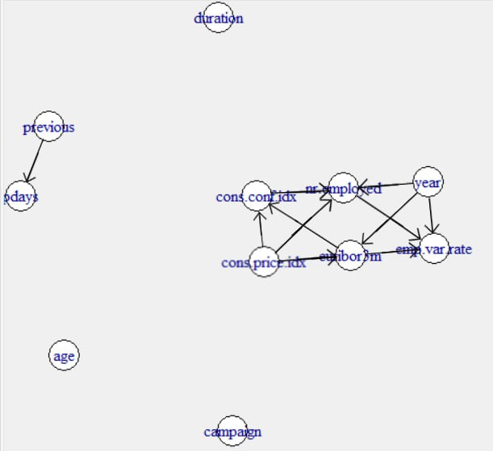

   

## Introduction

This project is dedicated to the binary classification problem.
The classification goal is aimed to predict if the client will accept a term deposit.
For the project we used real dataset with social and economic context provided by Portuguese banking institution.
The dataset is available by [THIS LINK](http://archive.ics.uci.edu/ml/datasets/Bank+Marketing#). There are four datasets, however we are using the largest one called "bank-additional-full.csv" with additional features and data.

While working on this project, we expect to achieve following results:

1.  Understanding the processes which lay behind the marketing campaign by analyzing the data;
2.  Estimating the impact of predictors on the target variable;
3.  Building a statistical model which will help us to select the clients who will probably accept a term deposit.

 

## 1. Dataset

First, we import required libraries.

 

```{r, message=FALSE}
library(pROC)
library(ROSE)
library(ggplot2)
library(cowplot)
library(dplyr)
library(Rmisc)
library(corrplot)
library(MASS)
library(caret)
library(regclass)
library(fastDummies)
library(class)
library(glmnet)
library(outliers)
library(Hmisc)
library(dplyr)
library(igraph)
library(gRbase)
library(FactoMineR)
library(e1071)

# set random seed
set.seed(1)
```

 

Then we read the dataset file.

 

```{r}
# reading data
data <- read.csv('../data/bank-additional-full.csv', sep=';', 
                 na.strings=c("unknown"))

# initial info
nrow(data)
ncol(data)
summary(data)

# class disbalance
table(data$y)

# missing values
ceiling(colSums(is.na(data)) / nrow(data) * 100)
```

 

Dataset consist of 41188 instances and 20 features.
It contains missing values, later we will take care of them.

 

### 1.1 Initial features

The dataset's source provides us with following feature description.
The features related to client:

+-------------------------+-------------------------------------------------------+
| Feature                 | Description                                           |
+:========================+:======================================================+
| Age (numeric)           | client's age.                                         |
+-------------------------+-------------------------------------------------------+
| Job (categorical)       | client's type of job                                  |
+-------------------------+-------------------------------------------------------+
| Marital (categorical)   | client's marital status                               |
+-------------------------+-------------------------------------------------------+
| Education (categorical) | client's education level                              |
+-------------------------+-------------------------------------------------------+
| Default (categorical)   | client's default status (has credit in default?)      |
+-------------------------+-------------------------------------------------------+
| Housing (categorical)   | client's house loan status (has client a house loan?) |
+-------------------------+-------------------------------------------------------+
| Loan (categorical)      | client's loan status (has client a loan?)             |
+-------------------------+-------------------------------------------------------+

The features related to the current marketing campaign:

+---------------------------+-------------------------------------------------------------------------------------------------------------------------------------+
| Feature                   | Description                                                                                                                         |
+:==========================+:====================================================================================================================================+
| Contact (categorical)     | contact type                                                                                                                        |
+---------------------------+-------------------------------------------------------------------------------------------------------------------------------------+
| Month (categorical)       | last contact month                                                                                                                  |
+---------------------------+-------------------------------------------------------------------------------------------------------------------------------------+
| Day_of_week (categorical) | last contact day of the week                                                                                                        |
+---------------------------+-------------------------------------------------------------------------------------------------------------------------------------+
| Duration (numeric)        | last contact duration.\                                                                                                             |
|                           | **In purpose of preventing data leakage, we will not use that feature, because we can't retrieve this feature for future clients.** |
+---------------------------+-------------------------------------------------------------------------------------------------------------------------------------+
| Campaign (numeric)        | shows number of contacts during current marketing campaign                                                                          |
+---------------------------+-------------------------------------------------------------------------------------------------------------------------------------+

The features related to the previous marketing campaign:

+------------------------+-----------------------------------------------------------------------------------------------------------------------+
| Feature                | Description                                                                                                           |
+:=======================+:======================================================================================================================+
| Pdays (numeric)        | shows number of days passed after last contact in current campaign (999 -- means this client wasn't contacted before) |
+------------------------+-----------------------------------------------------------------------------------------------------------------------+
| Previous (numeric)     | shows number of contacts in previous marketing campaign                                                               |
+------------------------+-----------------------------------------------------------------------------------------------------------------------+
| Poutcome (categorical) | shows the results of previous marketing campaign                                                                      |
+------------------------+-----------------------------------------------------------------------------------------------------------------------+

Features related to the bank:

+------------------------+-------------------------------------------------+
| Feature                | Description                                     |
+:=======================+:================================================+
| Emp.var.rate (numeric) | employment variation rate - quarterly indicator |
+------------------------+-------------------------------------------------+
| Nr.employed (numeric)  | number of employees - quarterly indicator       |
+------------------------+-------------------------------------------------+

Social and economic context features:

+--------------------------+-----------------------------------------------------------+
| Feature                  | Description                                               |
+:=========================+:==========================================================+
| Cons.price.idx (numeric) | consumer price index - monthly indicator                  |
+--------------------------+-----------------------------------------------------------+
| Cons.conf.idx (numeric)  | consumer confidence index - monthly indicator             |
+--------------------------+-----------------------------------------------------------+
| Euribor3m (numeric)      | the Euro Interbank offered 3 month rate - daily indicator |
+--------------------------+-----------------------------------------------------------+

The target variable:

+--------------------------+-----------------------------------------------------------------+
| Target variable          | Description                                                     |
+:=========================+:================================================================+
| The target variable is y | has the client subscribed a term deposit? (binary: 'yes','no'). |
+--------------------------+-----------------------------------------------------------------+

First, we're going to look at unique values for every categorical feature.
We might need this information for making factor representation for these features.

 

```{r}
# unique values of categorical features
categorical_feats <- c("default", "housing", "loan", "contact", "education", 
                       "job", "marital", "month", "day_of_week", "poutcome")
for (feat in categorical_feats) {
  print(feat)
  print(unique(data[, feat]))
  print("_________________________________________________________________")
}
```

 

According to given and obtained information, we can group the features by 4 categories:

-   Binary features ("default", "housing", "loan", "contact");
-   Ordinal features ("education");
-   Nominal features ("job", "marital", "month", "day_of_week", "poutcome");
-   Continuous features ("age", "duration", "campaign", "pdays", "previous", "emp.var.rate", "cons.price.idx", "cons.conf.idx", "euribor3m", "nr.employed").

 

```{r}
# group features
bin_feats <- c("default", "housing", "loan", "contact")
ordinal_feats <- c("education")
nominal_feats <- c("job", "marital",
                   "month", "day_of_week", "poutcome")
continuous_feats <- c("age", "duration", "campaign", "pdays", "previous",
                     "emp.var.rate", "cons.price.idx", "cons.conf.idx",
                     "euribor3m", "nr.employed")
```

 

### 1.2 Initial data preprocessing

Here we create a factor representation for categorical features.

 

```{r}
data$y <- as.factor(data$y)
data$marital <- factor(data$marital, levels = c("single", "divorced", 
                                                "married"), ordered = FALSE)
data$education <- factor(data$education, levels = c('illiterate',
                                                    'basic.4y','basic.6y',
                                                    'basic.9y','high.school',
                                                    'professional.course',
                                                    'university.degree'), 
                         ordered = TRUE)
data$default <- as.factor(data$default)
data$housing <- as.factor(data$housing)
data$loan <- as.factor(data$loan)
data$contact <- as.factor(data$contact)
                                                     
data$day_of_week <- factor(data$day_of_week, 
                           levels = c("mon", "tue", "wed", "thu", "fri"), 
                           ordered = FALSE)
data$poutcome <- factor(data$poutcome, levels = c("nonexistent", "failure", 
                                                  "success"), ordered = FALSE)
data$job <- factor(data$job, levels = c('admin.','blue-collar','entrepreneur',
                                        'housemaid', 'management','retired',
                                        'self-employed','services',
                                        'student','technician','unemployed'), 
                   ordered = FALSE)

# temporarily treat month as an ordered factor
data$month <- factor(data$month, levels = c("jan", "feb", "mar", "apr", "may", 
                                            "jun", "jul", "aug", "sep", "oct", 
                                            "nov", "dec"), ordered = TRUE)
```

 

### 1.3 Feature engineering

As all the examples in dataset are ordered by date and for each example we know the month of call, we can calculate year column since we know that the campaign has been started in 2008.
Also we can construct date feature.
It would be useful for further data analysis.

 

```{r}
# adding year
data$year <- NA
year = 2008
for (i in 1:(nrow(data)-1)) {
  data[i, 'year'] <- year
  if (data[i, 'month'] > data[i+1, 'month']) {
    year <- year + 1
  } 
}
data[i+1, 'year'] <- year
continuous_feats <- c(continuous_feats, "year")

# temporal variable for creating barplots
data$y_num <- as.integer(as.integer(data$y) - 1)

# adding date
data$date <- paste(as.character(data$year), "01", 
                   as.character(as.numeric(data$month)), 
                   sep = "-")
data$date <- as.Date(data$date)
levels = as.character(unique(data$date))
data$date <- as.character(data$date)
data$date <- factor(data$date, levels=levels, ordered = TRUE)
```

 

## 2 Exploratory Data Analysis

First, we want to know several things:

1.  How the quality of campaign changed during the time;
2.  How the amount and proportion of the clients changed during the time;
3.  How the number of calls changed during the time.

For that purpose, we plot following barplots and histograms.

 

```{r figure-with-options, fig.height=20, fig.width=20}
# Let's see how the quality of campaign changed during the time
# Preparing data for plots
data_sse <- summarySE(data, measurevar="y_num", groupvars="date")
# alpha for building confidence interval
a <- .05
interval_value <- qnorm(1 - a / 2) * sqrt((1 / data_sse$N) * data_sse$y_num * 
                                               (1 - data_sse$y_num))
data_sse$upper_bound <- data_sse$y_num + interval_value
data_sse$lower_bound <- data_sse$y_num - interval_value
data_sse$lower_bound <- ifelse(data_sse$lower_bound > 0, data_sse$lower_bound, 
                               0)
settings <- theme(plot.title = element_text(hjust = 0.5, size = 22),
                  axis.title.x = element_text(size = 22),
                  axis.title.y = element_text(size = 22))

c1 <- ggplot(data_sse, aes(x=date, y=y_num)) + 
  geom_bar(position=position_dodge(), stat="identity") +
  geom_errorbar(aes(ymin=lower_bound, ymax=upper_bound),
                width=.2,                  
                position=position_dodge(.9)) +
  labs(x = "Date", y = "Y ratio") + 
  ggtitle("Target values distribution by time") +
  settings

c2 <- ggplot(data, aes(x = date)) +
  geom_bar() + 
  labs(x = "Date", y = "Clients") + 
  ggtitle("Amount of calls by time") +
  settings

c3 <- ggplot(data, aes(x = date, y=y_num)) +
  geom_bar(stat = "identity", na.rm=TRUE) + 
  labs(x = "Date", y = "Positive Clients") + 
  ggtitle("Amount of positive clients by time") +
  settings 

cowplot::plot_grid(c1, c2, c3, labels = NULL, ncol = 1, align = "v")
```

 

By looking at this plot, we can make the following conclusions:

1.  Before June 2009, the bank used to make the calls to many clients. After this date, number of people, who was contacted by bank, per month has been decreased.
2.  Number of attracted clients per month has also been decreased.
3.  However, percentage of attracted clients per month has been sufficiently increased.

Probably, the bank had been changed its client searching policy after June 2009.
Further we are going to make an investigation and see how the bank could increase the percentage of attracted clients per month.
But before going deeper, we will plot correlation matrix.

 

### 2.1 Correlation matrix and independence graph

Here we plot correlation matrix for continuous features of the dataset.

 

```{r, fig.height=10, fig.width=10}
# plotting correlation matrix for continuous features
corrmat <- cor(data[, continuous_feats],
               use="pairwise.complete.obs")
corrplot(corrmat, method="number")
```

 

Then, in order to better understand the relationship between continuous features, we plot independence graph based on partial correlation matrix.

 

```{r, fig.height=5, fig.width=5}
# plotting independence graph
S <- var(data[, continuous_feats], use="pairwise.complete.obs")
P <- cov2cor(S)
R <- -cov2cor(solve(S))
thr <- 0.2
G <- abs(R)>thr
diag(G) <- 0
Gi <- as(G, "igraph")
tkplot(Gi, vertex.color="white")
```

{width=50%}

 

Here we can clearly see that features "year", emp.var.rate", "cons.price.idx", "cons.conf.idx", "euribor3m", "nr.employed" are highly correlated. A high correlation between social and economic context features seems to be natural. Those features depend on different aspects (historical and social events, crises etc) which are not available in this dataset. However they can be reflected by year. In our opinion, that's why feature "year" correlates to social and economic context features.

We can also notice a correlation between "pdays" and "previous", but it can be explained by the fact that if the client hadn't been contacted during previous campaign ("previous" = 0), pdays equals 999.

While applying statistical models, we have to handle correlating features in order to avoid multicollinearity.

After plotting independence graph, we manually added causality according to our assumptions.
For, example, "year" can't depend on social and economic context.
Also, features related to the bank can't affect features related to global market.

 

### 2.2 Features' distridution

Next, we plot the distribution of available predictors.
For each predictor we plot distribution of its values split by target variable and by dates.

 

#### 2.2.1 Continuous variables.

Here we plot distribution of continuous features.

First, we plot distribution of continuous variables split by target value.

 

```{r, fig.height=15, fig.width=20}
# distribution of continuous variables split by target pt 1

settings <- theme(axis.title.x = element_text(size = 22),
                  axis.title.y = element_text(size = 22),
                  legend.key.size = unit(1, 'cm'),
                  legend.text = element_text(size=10)) 

g_age <- ggplot(data,aes(x=age,fill=y))+
  ggplot2::geom_density(alpha=.3) + settings

g_duration <- ggplot(data,aes(x=duration,fill=y))+
  ggplot2::geom_density(alpha=.3) + settings

g_campaign <- ggplot(data,aes(x=campaign,fill=y))+
  ggplot2::geom_histogram(aes(y=0.5*..density..),
                          alpha=0.5,position='identity') + labs(y = "density")+
  settings

g_pdays <- ggplot(data,aes(x=pdays,fill=y))+
  ggplot2::geom_histogram(aes(y=0.5*..density..),
                          alpha=0.5,position='identity') + labs(y = "density")+
  settings

# also we plot distribution of real pdays (<999)
g_pdays_f <- ggplot(data[data$pdays<999, ],aes(x=pdays,fill=y))+
  ggplot2::geom_density(alpha=.3)+ labs(x = "pdays < 999") + settings

g_previous <- ggplot(data,aes(x=previous,fill=y))+
  ggplot2::geom_histogram(aes(y=0.5*..density..),
                          alpha=0.8,position='identity') + labs(y = "density")+
  settings 

plot <- plot_grid(g_age, g_duration, g_campaign,
                  g_pdays, g_pdays_f, g_previous,
                  labels = NULL, 
                  nrow = 2, ncol = 3)

title <- ggdraw() + 
  draw_label(
    "Distribution of continuous variables split by target",
    fontface = 'bold',
    x = 0,
    hjust = -0.1,
    size = 22
  )
plot_grid(
  title, plot,
  ncol = 1,
  rel_heights = c(0.1, 1)
)
```

 

```{r, fig.height=15, fig.width=20, Warnings=FALSE, message=FALSE}
# distribution of continuous variables split by target pt 2

g_emp.var.rate <- ggplot(data,aes(x=emp.var.rate,fill=y))+
  geom_histogram(aes(y=0.5*..density..),
                 alpha=0.5,position='identity') + labs(y = "density") + settings

g_cons.price.idx <- ggplot(data,aes(x=cons.price.idx,fill=y))+
  geom_histogram(aes(y=0.5*..density..),
                 alpha=0.5,position='identity') + labs(y = "density") + settings

g_cons.conf.idx <- ggplot(data,aes(x=cons.conf.idx,fill=y))+
  geom_histogram(aes(y=0.5*..density..),
                 alpha=0.5,position='identity') + labs(y = "density") + settings

g_euribor3m <- ggplot(data,aes(x=euribor3m,fill=y))+
  geom_histogram(aes(y=0.5*..density..),
                 alpha=0.5,position='identity') + labs(y = "density") + settings

g_nr.employed <- ggplot(data,aes(x=nr.employed,fill=y))+
  geom_histogram(aes(y=0.5*..density..),
                 alpha=0.8,position='identity') + labs(y = "density") + settings

plot <- plot_grid(g_emp.var.rate, g_cons.price.idx, g_cons.conf.idx,
                  g_euribor3m, g_nr.employed,
                  labels = NULL, 
                  nrow = 2, ncol = 3)

title <- ggdraw() + 
  draw_label(
    "Distribution of continuous variables split by target",
    fontface = 'bold',
    x = 0,
    hjust = -0.3,
    size = 22
  )
plot_grid(
  title, plot,
  ncol = 1,
  rel_heights = c(0.1, 1)
)
```

 

Considering 2 groups, we can observe that following features have different distributions:

-   Duration -- it simply could be explained by the fact that we need some time to persuade the costumer to take a term deposit and explain him all of details. In case if costumer is not interested, the conversation ends pretty soon.
-   Pdays -- it's clearly seen that if a costumer wasn't contacted during the previous campaign, the probability of rejection is higher.
-   Previous -- the same situation as we observed for pdays.

Second, we plot distribution of continuous variables split by date.

 

```{r, fig.height=15, fig.width=20}
# distribution of continuous variables split by date pt 1
par(mfrow=c(2, 3))
for (feat in continuous_feats[1:5]) {
  boxplot(data[,feat] ~ data[,"date"], xlab="date", ylab=feat,
          cex.lab=2)
}
mtext("Distribution of continuous variables split by date", side = 3, 
      line = - 2.5, outer = TRUE, cex=2.5)
```

 

```{r, fig.height=15, fig.width=20}
# Let's set ylim for some plots in order to eliminate some outliers with 
# extremely huge values
par(mfrow=c(2, 3))
boxplot(data$age ~ data$date, xlab="date", ylab="age", cex.lab=2)
boxplot(data$duration ~ data$date, xlab="date", 
        ylab="duration", ylim = c(0, 2000), cex.lab=2)
boxplot(data$campaign ~ data$date, xlab="date", ylab="campaign", 
        ylim = c(0, 10), cex.lab=2)
# here we're considering only real pdays
boxplot(data[data$pdays<999, 'pdays'] ~ data[data$pdays<999, 'date'], 
        xlab='date', ylab='pdays', cex.lab=2)
boxplot(data$previous ~ data$date, xlab="date", ylab="previous", cex.lab=2)
mtext("Distribution of continuous variables split by date", side = 3, 
      line = - 2, outer = TRUE, cex=2.5)
```

 

```{r, fig.height=15, fig.width=20}
# distribution of continuous variables split by date pt 2
par(mfrow=c(2, 3))
for (feat in continuous_feats[6:10]) {
  boxplot(data[,feat] ~ data[,"date"], xlab="date", ylab=feat, cex.lab=2)
}
mtext("Distribution of continuous variables split by date", side = 3, 
      line = - 2, outer = TRUE, cex=2.5)
```

 

```{r, fig.height=15, fig.width=20}
# some of these features are constant during a month or three months
# let's use other kind of plot

agg_tbl <- data %>% dplyr::group_by(date) %>% 
  dplyr::summarise(emp.var.rate=unique(emp.var.rate))
agg_tbl$cons.price.idx <- as.data.frame(data %>% dplyr::group_by(date) %>% 
  dplyr::summarise(cons.price.idx=unique(cons.price.idx)))$cons.price.idx
agg_tbl$cons.conf.idx <-as.data.frame(data %>% dplyr::group_by(date) %>% 
  dplyr::summarise(cons.conf.idx=unique(cons.conf.idx)))$cons.conf.idx
agg_tbl$nr.employed <-as.data.frame(data %>% dplyr::group_by(date) %>% 
  dplyr::summarise(nr.employed=unique(nr.employed)))$nr.employed
list_plots <- list()
list_plots <- outlist <- append(list_plots, list(ggplot(agg_tbl, 
                                                   aes(x = date,
                                                       y = emp.var.rate, 
                                                    group = 1)) + geom_line() +
                                                    settings))
list_plots <- outlist <- append(list_plots, list(ggplot(agg_tbl, 
                                                   aes(x = date, 
                                                       y = cons.price.idx, 
                                                    group = 1)) + geom_line() +
                                                    settings))
list_plots <- outlist <- append(list_plots, list(ggplot(agg_tbl, 
                                                   aes(x = date,
                                                      y = cons.conf.idx, 
                                                    group = 1)) + geom_line() +
                                                    settings))
list_plots <- outlist <- append(list_plots, list(ggplot(agg_tbl, 
                                                   aes(x = date,
                                                       y = nr.employed, 
                                                    group = 1)) + geom_line() +
                                                    settings))
plot <- plot_grid(plotlist=list_plots, 
                  labels = NULL, 
                  nrow = 4, ncol = 1)
title <- ggdraw() + 
  draw_label(
    "Social and economic context feature",
    fontface = 'bold',
    x = 0,
    hjust = -0.4,
    size = 22
  )
plot_grid(
  title, plot,
  ncol = 1,
  rel_heights = c(0.1, 1)
)
```

 

Here we can see how bank, social and economic context features changed their values starting from a beginning of the campaign.
By looking at emp.var.rate's trend line, it's clearly seen that the bank's administration decided to decrease the number of employees involved in this campaign after August 2008.
Perhaps, the goal of that decision was saving man hours and labor costs.

Moreover, we can estimate inflation rate by looking at cons.price.idx's trend line.
At first, it shows reducing inflation. As the rule, reducing inflation make interest rate (euribor3m) become lower. This could be another reason why bank's administration decided to decrease the number of employees involved in this campaign: during the periods characterized by low interest rate, it's more profitable to use other kinds of investments.

Also we can observe decreasing Euribor rate which coincides to decreasing of total number of bank's employees.

Previously we have seen that the bank reduced number of contacts after the middle of 2009.
If we look at the boxplot for "Previous", we can see, that after this date bank started to make an emphasis on the clients who was contacted before.
Probably, those clients are loyal one and there's a high probability that they'll accept the proposition again. This could explain the raising of acceptance ratio that we have seen before.

#### 2.2.2 Binary variables.

Here we plot distribution of binary features.

As before, we plot distribution of the variables split by target value.

 

```{r, fig.height=10, fig.width=15}
list_plots <- list()
# alpha for building confidence interval
a <- .05
for (feat in bin_feats) {
  if (feat == "contact") {lab = "contact is phone"} else {lab = feat}
  data_feat <- data[!is.na(data[, feat]), ]
  data_feat[, feat] <- as.factor(data_feat[, feat])
  data_feat[, feat] <- as.numeric(data_feat[, feat]) - 1
  data_temp_sse <- summarySE(data_feat, measurevar=feat, groupvars="y")
  interval_value <- qnorm(1 - a / 2) * sqrt((1 / data_temp_sse$N) * 
                                              data_temp_sse[, feat] * 
                                              (1 - data_temp_sse[, feat]))
  interval_value[is.na(interval_value)] <- 0
  data_temp_sse$upper_bound <- data_temp_sse[, feat] + interval_value
  data_temp_sse$lower_bound <- data_temp_sse[, feat] - interval_value
  data_temp_sse$lower_bound <- ifelse(data_temp_sse$lower_bound > 0, 
                                      data_temp_sse$lower_bound, 0)
  curr_plot <- ggplot(data_temp_sse, aes(x=.data[["y"]], y=.data[[feat]])) + 
    geom_bar(position=position_dodge(), stat="identity") +
    geom_errorbar(aes(ymin=lower_bound, ymax=upper_bound),
                  width=.2,                    # Width of the error bars
                  position=position_dodge(.9)) + 
    settings + ylab(lab)
  list_plots <- outlist <- append(list_plots,list(curr_plot))
}

plot <- plot_grid(plotlist=list_plots, 
          labels = NULL, 
          nrow = 2, ncol = 2)

title <- ggdraw() + 
  draw_label(
    "Distribution of binary variables split by target",
    fontface = 'bold',
    x = 0,
    hjust = -0.3,
    size = 22
  )
plot_grid(
  title, plot,
  ncol = 1,
  rel_heights = c(0.1, 1)
)
```

 

Now we plot distribution of binary variables split by date.

 

```{r, fig.height=15, fig.width=20}
# distribution of binary variables split by date 
list_plots <- list()
for (feat in bin_feats) {
  if (feat == "contact") {lab = "contact is phone"} else {lab = feat}
  data_temp <- data[!is.na(data[, feat]), ]
  data_temp[, feat] <- as.factor(data_temp[, feat])
  data_temp[, feat] <- as.numeric(data_temp[, feat]) - 1
  data_temp_sse <- summarySE(data_temp, measurevar=feat, groupvars="date")
  interval_value <- qnorm(1 - a / 2) * sqrt((1 / data_temp_sse$N) * 
                                              data_temp_sse[, feat] * 
                                              (1 - data_temp_sse[, feat]))
  interval_value[is.na(interval_value)] <- 0
  data_temp_sse$upper_bound <- data_temp_sse[, feat] + interval_value
  data_temp_sse$lower_bound <- data_temp_sse[, feat] - interval_value
  data_temp_sse$lower_bound <- ifelse(data_temp_sse$lower_bound > 0, 
                                      data_temp_sse$lower_bound, 0)
  curr_plot <- ggplot(data_temp_sse, aes(x=.data[["date"]], y=.data[[feat]])) + 
    geom_bar(position=position_dodge(), stat="identity") +
    geom_errorbar(aes(ymin=lower_bound, ymax=upper_bound),
                  width=.2,                    # Width of the error bars
                  position=position_dodge(.9)) +
    settings + ylab(lab)
  list_plots <- outlist <- append(list_plots,list(curr_plot))
}

plot <- plot_grid(plotlist=list_plots, 
                  labels = NULL, 
                  nrow = 4, ncol = 1)
title <- ggdraw() + 
  draw_label(
    "Distribution of binary variables split by date",
    fontface = 'bold',
    x = 0,
    hjust = -0.4, 
    size = 22
  )
plot_grid(
  title, plot,
  ncol = 1,
  rel_heights = c(0.1, 1)
)
```

 

We can provide obtained plots with following comments: 

-   The boxplots for "Default" are not informative because there are only 3 people who has credit in default.
-   By looking at the boxplot for "Contact" (split by target), we may notice that the acceptance rate for cellular contact is higher. But if we look at other boxplot for "Contact" (split by date), we can see that bank simply decided to give a preference to cellular contact after the changes of the policy, which has increased acceptance rate. It explains observed effect.

 

#### 2.2.3 Categorical variables.

Here we plot distribution of categorical features.
Again, we plot distribution of the variables split by target value.

 

```{r, fig.height=15, fig.width=20}
# distribution of categorical variables split by target
list_plots <- list()
for (feat in c(nominal_feats, ordinal_feats)) {
  data_feat <- with(data, table(y, data[, feat], dnn = c('y', feat)))
  data_feat <- as.data.frame(data_feat)
  # For each group we normalize the frequencies separately
  data_feat$NormFreq <- data_feat$Freq / 
    sapply(data_feat$y, function(x) sum(data_feat[data_feat$y == x, 'Freq']))
  curr_plot <- ggplot(data_feat, aes(x=.data[["y"]], y=.data[["NormFreq"]], 
                                     fill = .data[[feat]])) +     
    geom_col(position = 'dodge') + 
    ylab(feat) +
    settings
  list_plots <- outlist <- append(list_plots,list(curr_plot))
}
plot <- plot_grid(plotlist=list_plots, labels = NULL, nrow = 3, ncol = 2)
title <- ggdraw() + 
  draw_label(
    "Distribution of categorical variables split by target",
    fontface = 'bold',
    x = 0,
    hjust = -0.4,
    size = 22
  )
plot_grid(
  title, plot,
  ncol = 1,
  rel_heights = c(0.1, 1)
)
```

 

Now we plot distribution of categorical variables split by date.
In case of categorical features, we can't plot the features' distribution for each date.
That's why we will consider only 2 periods: before changing of policy and after.

 

```{r, fig.height=15, fig.width=20, Warnings=FALSE, message=FALSE}
# distribution of categorical variables split by date
list_plots <- list()
cut_date <- as.Date("2009-01-05")
cut_date <- as.character(cut_date)
for (feat in c(nominal_feats, ordinal_feats)) {
  data_timesplit <- data
  data_timesplit$timesplit <- data_timesplit$date > cut_date
  data_feat <- with(data_timesplit, table(timesplit, data_timesplit[, feat], 
                                          dnn = c('timesplit', feat)))
  data_feat <- as.data.frame(data_feat)
  data_feat$NormFreq <- data_feat$Freq / 
    sapply(data_feat$timesplit, 
           function(x) sum(data_feat[data_feat$timesplit == x, 'Freq']))
  curr_plot <- ggplot(data_feat, aes(x=.data[["timesplit"]], 
                                     y=.data[["NormFreq"]], 
                                     fill = .data[[feat]])) +     
    geom_col(position = 'dodge') + 
    ylab(feat)  +
    settings + scale_x_discrete(labels=c("TRUE" = "after", "FALSE" = "before"))
  list_plots <- outlist <- append(list_plots,list(curr_plot))
}
plot <- plot_grid(plotlist=list_plots, labels = NULL, nrow = 3, ncol = 2)
title <- ggdraw() + 
  draw_label(
    "Distribution of categorical variables split by date",
    fontface = 'bold',
    x = 0,
    hjust = -0.4,
    size = 22
  )
plot_grid(
  title, plot,
  ncol = 1,
  rel_heights = c(0.1, 1)
)
```

 

The distribution built for "Poutcome" confirms the assumption about changing the policy.
Indeed, bank started to make an emphasis on the clients who had accepted the proposition during the previous campaign.

 

### 2.3 General conclusions

We can point out and gather main conclusions obtained above:

1.  After June 2009, the bank policy has changed. It started making less calls and the calls became more aimed on clients which had accepted previous propositions.
2.  This solution could be made because of reducing inflation and interest rate (euribor3m). The bank probably expected demand for term deposit to become lower. 
3.  This is also the reasom why the bank decreased number of employees involved in the campaign.

 

## 3 Building classification model

After data analysis and understanding the processes which lay behind the marketing campaign, we are going to fit test several predictive models which was covered during the course:

1.  Logistic regression

2.  Ridge classifier

3.  Lasso classifier

4.  Linear discriminant analysis

5.  Quadratic discriminant analysis

6.  Naive Bayes

7.  K-NN

 

### 3.1 Initial feature selection

Before applying mentioned above methods, we must remove some features, that can't be used for particular reasons.
For example, we must delete "Duration" in order to avoid data leakage.
Obviously, there are some useless features like "Default", which is almost constant.
Some features can't be used considering validation strategy described further.
For example, we can't use "Month" because R doesn't allow as to use unseen during training factor levels.

 

```{r}
# remove leak feats
data <- subset(data, select = -c(duration))

# remove useless feats
# save default values for feature needs
default <- data$default
default[is.na(default)] <- "no"

# remove useless feats
data <- subset(data, select = -c(default))

# remove feats which can't be used for prediction
data <- subset(data, select = -c(month, date, y_num))

# update groups of feats
continuous_feats <- continuous_feats[! continuous_feats %in% c('duration')]
nominal_feats <- nominal_feats[! nominal_feats %in% c('month')]
bin_feats <- bin_feats[! bin_feats %in% c('default')]
```

 

### 3.2 Validation strategy

As we deal with temporal data, we can't use such techniques as random train test split and k-fold cross-validation.
Instead, we are going to split the data in the way that the most recent examples go to train set and the last ones go to test set.
Also, in case if we have to select models' hyperparameters, we are going to use validation set, which could be obtained by selecting the latest examples from training set.

 

```{r}
# time series train test split
# leave 25% of examples for a test set
cut_idx = round(nrow(data) * 0.75)
train <- data[1:cut_idx, ]
test <- data[(cut_idx+1):nrow(data), ]

# check target distribution in the datasets
table(train$y) / nrow(train) * 100
table(test$y) / nrow(test) * 100
```

 

Unfortunately, this splitting strategy doesn't guarantee us preserving the same class proportion in obtained datasets.
Moreover, in our case we can see that most of the train samples belong to the period before changing the policy and most of the test samples belong to the period after changing the policy.
For this reason, it could be hard to achieve a good quality for test set.

Despite those difficulties, we will anyway act according to chosen validation strategy.

 

### 3.3 Filling missing values

As we have seen before, missing values preserves only in categorical features.
We are going to fill them with mode values obtained from train dataset.

 

```{r}
# function for calcilating mode
calc_mode <- function(x){
  
  vals <- unique(x)
  counts <- tabulate(match(x, vals))
  mode <- vals[which.max(counts)]
  return(mode)
}

# function for filling train and test sets
fill_na_tr_tst <- function(tr, tst, feats) {
  tr_filled <- tr
  tst_filled <- tst
  for (feat in feats) {
    mode_val <- calc_mode(tr[, feat])
    tr_filled[is.na(tr_filled[, feat]), feat] <- mode_val
    tst_filled[is.na(tst_filled[, feat]), feat] <- mode_val
  }
  return(list(train = tr_filled, test = tst_filled))
}

# fill NA with mode
missing_feats <- c("job", "education", "marital", "housing", "loan")
filled_dfs <-fill_na_tr_tst(train, test, missing_feats)
train <- filled_dfs$train
test <- filled_dfs$test
```

 

### 3.4 Removing outliers

Some methods such as LDA and QDA are sensitive to outliers.
For this reason, we are going to detect and remove them.

First, we are going to remove those rare clients who has credit in default.
Also we have seen that "Campaign" has several large values, for example 50.
It's difficult to imagine that it's possible to call the client so many times.
We're going to remove those larger values by applying IQR method of outlier detection.

 

```{r}
# remove outliers from train set
train <- train[default[0:cut_idx] != "yes", ]
max_campaign <- quantile(train$campaign)[4] + 1.5*IQR(train$campaign)
train <- train[train$campaign <= max_campaign, ]

# create a validation set
val_cut_idx = round(nrow(train) * 0.85)
val_train <- train[0:val_cut_idx, ]
val_val <- train[(val_cut_idx+1):nrow(train), ]
```

 

### 3.5 Metric choice

As we work with unbalanced dataset, we are going to use area under the ROC Curve as an evaluation metric.
In a business scenario, we have a certain set of the potential clients and our task is to search people among given set for participating in the campaign.
As the rule, we don't have enough time to call every client.
This is the reason why we want to start with people who would probably accept the proposition.
Basically, we need to order given set by estimated probability of acceptance and area under the ROC Curve is very suitable metric for that kind of task.

Also we are going to take a look at confusion matrices in order to understand what kind of errors models make.

 

### 3.6 Data preprocessing for Ridge classifier, Lasso classifier and K-NN

As Ridge classifier, Lasso classifier and K-NN are not able to handle factors in R, we should transform them into numeric format.
The most appropriate approach for those method is One Hot Encoding.
Moreover, as K-NN based on distance computation, it's highly recommended to scale the features.
For this purpose, we will use Min Max Scaling like this $$Xscaled=\frac{X - min(x)} {max(X) - min(X)}$$

 

```{r}
# additional data preprocessing for Ridge, Lasso, KNN
# create dummies
data_for_dummies <- rbind(train, test)
data_dummies <- dummy_cols(data_for_dummies, 
                           select_columns=c(bin_feats, ordinal_feats, 
                                            nominal_feats),
                           remove_selected_columns=TRUE)
# replace "-" with "_" for avoiding further errors
colnames(data_dummies)[colnames(data_dummies) == 
                         "job_blue-collar"] <- "job_blue_collar"
colnames(data_dummies)[colnames(data_dummies) == 
                         "job_self-employed"] <- "job_self_employed"
# again, train test split
train_dummies <- data_dummies[1:nrow(train), ]
test_dummies <- data_dummies[(nrow(train_dummies)+1):nrow(data_dummies), ]

# min max scaling
mins <- sapply(subset(train_dummies, select = -c(y)), min)
maxs <- sapply(subset(train_dummies, select = -c(y)), max)
maxs_m_mins <- maxs - mins

# function for min max scaling
min_max_scaling <- function(df, mins, maxs_m_mins) {
  df_sc <- sweep(subset(df, select = -c(y)),
                 2,
                 mins)
  df_sc <- sweep(df_sc,
                 2,
                 maxs_m_mins, FUN='/')
  df_sc$y <- df$y
  return(df_sc)
}

train_dummies_sc <- min_max_scaling(train_dummies, mins, maxs_m_mins)
test_dummies_sc <- min_max_scaling(test_dummies, mins, maxs_m_mins)

# leave some samples for validation set
val_train_dummies_sc <- train_dummies_sc[0:val_cut_idx, ]
val_val_dummies_sc <- train_dummies_sc[(val_cut_idx+1):nrow(train_dummies), ]
```

 

### 3.7 Modeling

 

#### 3.7.1 Logistic regression.

We start with simple logistic regression.
Here we are not able to adjust any hyperparameters, hence we use the whole train set for fitting the model.
For this step, we will use all the features in order to estimate later multicollinearity by using Variance Inflation Factor (VIF).

 

```{r, Warnings=FALSE, message=FALSE, out.width = "50%"}
# Logistic regression
# set default threshold for computing binary predictions
threshold <- 0.5
# modeling
model_lr <- glm(y ~., data=train, family = binomial)
summary(model_lr)

# prediction
probabilities_lr <- predict(model_lr, test, type="response")
preds_lr <- ifelse(probabilities_lr > threshold, "yes", "no")
preds_lr <- factor(preds_lr, levels=c("no", "yes"))

# evaluation
roc_score_lr <- roc(test$y, probabilities_lr)
plot(roc_score_lr ,main =sprintf("ROC curve for Logistic Regression. AUC = %s", 
                              round(roc_score_lr$auc, 2)))
confusionMatrix(data=preds_lr, reference = test$y)
```

 

Considering the fact that train and test client are treated according to different policies, we've obtained a good quality for the test set.
Also we can point several significant for a model features: "job" (is the client student or retired), "day_of_week", " emp.var.rate", "euribor3m", "nr.employed" and "year".
However, we haven't eliminated multicollinearity, and that's the reason why we could obtain unstable estimates of coefficients.

For this reason, we're going to use VIF in order to explore the degree of multicollinearity.
Due to presence of categorical features, we are going to use a modification of VIF, which can be computed as $GVIF^{\frac {1} {2 Df}}$, where $GVIF=\sqrt{VIF}$, $Df$ is a number of levels for categorical feature (it equals one in case of continuous features).

The rule of thumb here is to achieve at most $\sqrt{10}$ for each predictor.

 

```{r}
# VIF
VIF(model_lr)
```

 

As we may see, the features from 2 groups of correlated predictors mentioned before have large values of modified GVIF:

1.  The first group: "year", emp.var.rate", "cons.price.idx", "cons.conf.idx", "euribor3m", "nr.employed"
2.  The second group: "pdays" and "previous"

First, we tried to remove those features one by one sequentially until we got small values of modified GVIF.
However if we remove one of the features from the first group, the test metric dramatically reduces its value.
This could lead to a conclusion that, despite of the correlation of those features, we might loose an important information by removing those features.
As a solution, we can use Principal Component Analysis (PCA).
By applying this method, we can substitute those features by their linear combination, and new features won't be correlated.
This will help us to reduce multicollinearity without decreasing of model quality.
However, it will obscure the interpretation of a model since we can't interpret new features.

 

```{r, Warnings=FALSE, message=FALSE, out.width = "50%"}
# PCA + removing pdays and previous
first_g_correlated_feats <- c("year", "nr.employed", "euribor3m", 
                              "emp.var.rate", "cons.price.idx")
pca <- PCA(train[,first_g_correlated_feats], graph = FALSE)
pca_train <- subset(train, select = -c(year, nr.employed, euribor3m, 
                                       emp.var.rate, cons.price.idx))
pca_test <- subset(test, select = -c(year, nr.employed, euribor3m, 
                                     emp.var.rate, cons.price.idx))
pca_comps_train <- predict(pca, train[,first_g_correlated_feats])$coord
pca_comps_test <- predict(pca, test[,first_g_correlated_feats])$coord
pca_train <- cbind(pca_train, pca_comps_train)
pca_test <- cbind(pca_test, pca_comps_test)

model_pca_lr <- glm(y ~.-pdays-previous, data=pca_train, family = binomial)
# now we have reduced multicollinearity
VIF(model_pca_lr)
summary(model_pca_lr)

# prediction
probabilities_pca_lr <- predict(model_pca_lr, pca_test, type="response")
preds_pca_lr <- ifelse(probabilities_pca_lr > threshold, "yes", "no")
preds_pca_lr <- as.factor(preds_pca_lr)

# evaluation
roc_score_pca_lr <- roc(test$y, probabilities_lr)
plot(roc_score_pca_lr ,main =sprintf("ROC curve for Logistic Regression. AUC = %s", 
                              round(roc_score_pca_lr$auc, 2)))
confusionMatrix(data=preds_pca_lr, reference = test$y)
```

 

Now we can see that we've eliminated multicollinearity without any loss of quality.
The significant features are "job" (is the client student or retired), "day_of_week", "poutcome".

Since the dataset is unbalanced, we may try to apply oversampling.

 

```{r, Warnings=FALSE, message=FALSE, out.width = "50%"}
# oversampling
pca_over_train <- ovun.sample(y~., data = pca_train, method = "over")$data

# modeling
model_pca_over_lr <- glm(y ~.-pdays-previous, data=pca_over_train, 
                         family = binomial)
summary(model_pca_over_lr)

# prediction
probabilities_pca_over_lr <- predict(model_pca_over_lr, pca_test, type="response")
preds_pca_over_lr <- ifelse(probabilities_pca_over_lr > threshold, "yes", "no")
preds_pca_over_lr <- factor(preds_pca_over_lr, levels=c("no", "yes"))

# evaluation
roc_score_pca_over_lr <- roc(test$y, probabilities_pca_over_lr)
plot(roc_score_pca_over_lr ,main =sprintf("ROC curve for Logistic Regression. AUC = %s", 
                              round(roc_score_pca_over_lr$auc, 2)))
confusionMatrix(data=preds_pca_over_lr, reference = test$y)
```

 

As result, the metric doesn't change its value, however the model started to be too confident in terms of giving positive labels to test samples.

After resampling we can exploit several plots for error analysis.

 

```{r, Warnings=FALSE, message=FALSE, out.width = "50%"}
# model diagnostics
par(mfrow=c(2,2))
plot(model_pca_over_lr)
par(mfrow=c(1,1))
```

 

By looking at the plots we can make following conclusions:

1.  In general, there is no linear trend between predicted values and residuals, however there is resampled point which has a huge pearson residual and it affect the absence of the trend
2.  The residuals are distributed almost normaly
3.  The point mentioned before creates heteroscedasticity. Also we can see increased standard deviation of errors around zero point
4.  There are no leverage points which are influential in our model

Finally, we will try to perform feature selection in order to get rid of useless information.
We are going to use Backward and Forward Stepwise Selection.
Both of them use Akaike information criterion for selecting features.

 

```{r, Warnings=FALSE, message=FALSE, out.width = "50%"}
# Backward Stepwise Selection
model_pca_lr <- glm(y ~.-pdays-previous, data=pca_train, family = binomial)
b_step <- step(model_pca_lr, direction= "backward", 
               scope=formula(model_pca_lr), trace=0)
# Removed features
b_step$anova

model_pca_fsel_lr <- glm(y ~.-pdays-previous-housing-campaign-loan-Dim.4-age, 
                         data=pca_train, family = binomial)
summary(model_pca_fsel_lr)

# prediction
probabilities_pca_fsel_lr <- predict(model_pca_fsel_lr, pca_test, 
                                     type="response")
preds_pca_fsel_lr <- ifelse(probabilities_pca_fsel_lr > threshold, "yes", "no")
preds_pca_fsel_lr <- factor(preds_pca_fsel_lr, levels=c("no", "yes"))

# evaluation
roc_score_pca_fsel_lr <- roc(test$y, probabilities_pca_fsel_lr)
plot(roc_score_pca_fsel_lr ,main =sprintf("ROC curve for Logistic Regression. AUC = %s", 
                              round(roc_score_pca_fsel_lr$auc, 2)))
confusionMatrix(data=preds_pca_fsel_lr, reference = test$y)
```

 

Test metric has decreased a little.
However, now it's easier to interpret the model.

 

```{r, Warnings=FALSE, message=FALSE}
# Forward Stepwise Selection
model_intercept <- glm(y ~ 1, data=pca_train, family = binomial)
f_step <- step(model_intercept, direction= "forward", 
               scope=formula(model_pca_lr), trace=0)
# Removed features
f_step$anova
# The same results
```

 

After Forward Stepwise Selection we obtain the same feature set as before.

 

#### 3.7.2 Ridge classifier.

Next we are going to apply Ridge classifier.
The regularization allows us to deal directly with datasets which have a problem related to multicollinearity.
Also it helps to prevent overfitting.

Here we will use validation set for selecting regularization parameter.

 

```{r, Warnings=FALSE, message=FALSE, out.width = "50%"}
# Ridge
# convert the data to required format
X_val_train_mat <- as.matrix(subset(val_train_dummies_sc, select = -c(y)))
y_val_train_mat <- as.matrix(as.numeric(val_train_dummies_sc$y)-1)
X_val_val_mat <- as.matrix(subset(val_val_dummies_sc, select = -c(y)))
y_val_val_mat <- as.matrix(as.numeric(val_val_dummies_sc$y)-1)
X_train_mat <- as.matrix(subset(train_dummies_sc, select = -c(y)))
y_train_mat <- as.matrix(as.numeric(train_dummies_sc$y)-1)
X_test_mat <- as.matrix(subset(test_dummies_sc, select = -c(y)))
y_test_mat <- as.matrix(as.numeric(test_dummies_sc$y)-1)

# selecting lambda
model_ridge <- glmnet(x=X_val_train_mat, y=y_val_train_mat,
                      family = binomial, alpha = 0)
probabilities_ridge <- predict(model_ridge, X_val_val_mat, type="response")
roc_auc_scores <- sapply(as.data.frame(probabilities_ridge),
                         function(x) roc(val_val_dummies_sc$y, x)$auc)
lambdas <- model_ridge$lambda
plot(lambdas, roc_auc_scores, type="l", main ="Validation curve for Ridge")
lambda = lambdas[roc_auc_scores == max(roc_auc_scores)][1]

# modeling
model_ridge <- glmnet(x=X_train_mat, y=y_train_mat,
                      family = binomial, alpha = 0, lambda = lambda)

# prediction
probabilities_ridge <- predict(model_ridge, X_test_mat,
                               type="response")
probabilities_ridge <- as.vector(probabilities_ridge)
preds_ridge <- ifelse(probabilities_ridge > threshold, "yes", "no")
preds_ridge <- as.factor(preds_ridge)

# evaluation
roc_score_ridge <- roc(test_dummies_sc$y, probabilities_ridge)
plot(roc_score_ridge ,main =sprintf("ROC curve for Ridge. AUC = %s",
                              round(roc_score_ridge$auc, 2)))
confusionMatrix(data=preds_ridge, reference = test$y)
```

 

We can see that model doesn't give any sample a positive class.
We may try to use oversampling.

```{r, Warnings=FALSE, message=FALSE, out.width = "50%"}
# oversampling
val_train_dummies_sc_over <- ovun.sample(y~., data = val_train_dummies_sc,
                                         method = "over")$data
train_dummies_sc_over <- ovun.sample(y~., data = train_dummies_sc,
                                         method = "over")$data

X_val_train_over_mat <- as.matrix(subset(val_train_dummies_sc_over,
                                         select = -c(y)))
y_val_train_over_mat <- as.matrix(as.numeric(val_train_dummies_sc_over$y)-1)
X_train_over_mat <- as.matrix(subset(train_dummies_sc_over, select = -c(y)))
y_train_over_mat <- as.matrix(as.numeric(train_dummies_sc_over$y)-1)

# selecting lambda
model_ridge_over <- glmnet(x=X_val_train_over_mat, y=y_val_train_over_mat,
                      family = binomial, alpha = 0)
probabilities_ridge_over <- predict(model_ridge_over, X_val_val_mat,
                                    type="response")
roc_auc_scores <- sapply(as.data.frame(probabilities_ridge_over),
                         function(x) roc(val_val_dummies_sc$y, x)$auc)
lambdas <- model_ridge_over$lambda
plot(lambdas, roc_auc_scores, type="l", main ="Validation curve for Ridge")
lambda = lambdas[roc_auc_scores == max(roc_auc_scores)][1]

# modeling
model_ridge_over <- glmnet(x=X_train_over_mat, y=y_train_over_mat,
                      family = binomial, alpha = 0, lambda = lambda)

# prediction
probabilities_ridge_over <- predict(model_ridge_over, X_test_mat,
                                    type="response")
probabilities_ridge_over <- as.vector(probabilities_ridge_over)
preds_ridge_over <- ifelse(probabilities_ridge_over > threshold, "yes", "no")
preds_ridge_over <- as.factor(preds_ridge_over)

# evaluation
roc_score_ridge_over <- roc(test$y, probabilities_ridge_over)
plot(roc_score_ridge_over ,main =sprintf("ROC curve for Ridge. AUC = %s",
                              round(roc_score_ridge_over$auc, 2)))
confusionMatrix(data=preds_ridge_over, reference = test$y)
```

 

Unfortunately, oversampling made the quality worse and after that model gives only positive labels to test samples.

 

#### 3.7.3 Lasso classifier.

Now we are going to apply Lasso classifier.
We will perform the same steps as for Ridge.

 

```{r, Warnings=FALSE, message=FALSE, out.width = "50%"}
# Lasso
# selecting lambda
model_lasso <- glmnet(x=X_val_train_mat, y=y_val_train_mat, 
                      family = binomial, alpha = 1)
probabilities_lasso <- predict(model_lasso, X_val_val_mat, type="response")
roc_auc_scores <- sapply(as.data.frame(probabilities_lasso), 
                         function(x) roc(val_val_dummies_sc$y, x)$auc)
lambdas <- model_lasso$lambda
plot(lambdas, roc_auc_scores, type="l", main ="Validation curve for Lasso")
lambda = lambdas[roc_auc_scores == max(roc_auc_scores)][1]

# modeling
model_lasso <- glmnet(x=X_train_mat, y=y_train_mat, 
                      family = binomial, alpha = 1, lambda = lambda)

# prediction
probabilities_lasso <- predict(model_lasso, X_test_mat, 
                               type="response")
probabilities_lasso <- as.vector(probabilities_lasso)
preds_lasso <- ifelse(probabilities_lasso > threshold, "yes", "no")
preds_lasso <- as.factor(preds_lasso)

# evaluation
roc_score_lasso <- roc(test$y, probabilities_lasso)
plot(roc_score_lasso ,main =sprintf("ROC curve for Lasso. AUC = %s",
                             round(roc_score_lasso$auc, 2)))
confusionMatrix(data=preds_lasso, reference = test$y)
```

 

Again, we try oversampling.

 

```{r, Warnings=FALSE, message=FALSE, out.width = "50%"}
# oversampling
# selecting lambda
model_lasso_over <- glmnet(x=X_val_train_over_mat, y=y_val_train_over_mat,
                           family = binomial, alpha = 1)
probabilities_lasso_over <- predict(model_lasso_over, X_val_val_mat,
                                    type="response")
roc_auc_scores <- sapply(as.data.frame(probabilities_lasso_over),
                         function(x) roc(val_val_dummies_sc$y, x)$auc)
lambdas <- model_lasso_over$lambda
plot(lambdas, roc_auc_scores, type="l", main ="Validation curve for Lasso")
lambda = lambdas[roc_auc_scores == max(roc_auc_scores)][1]

# modeling
model_lasso_over <- glmnet(x=X_train_over_mat, y=y_train_over_mat,
                           family = binomial, alpha = 1, lambda = lambda)

# prediction
probabilities_lasso_over <- predict(model_lasso_over, X_test_mat,
                                    type="response")
probabilities_lasso_over <- as.vector(probabilities_lasso_over)
preds_lasso_over <- ifelse(probabilities_lasso_over > threshold, "yes", "no")
preds_lasso_over <- as.factor(preds_lasso_over)

# evaluation
roc_score_lasso_over <- roc(test$y, probabilities_lasso_over)
plot(roc_score_lasso_over ,main =sprintf("ROC curve for Lasso. AUC = %s",
                              round(roc_score_lasso_over$auc, 2)))
confusionMatrix(data=preds_lasso_over, reference = test$y)
```

 

Unfortunately, in both cases we have weak quality.

 

#### 3.7.4 Linear discriminant analysis.

Before applying LDA and QDA to our problem, we should check the required assumptions.
In particular, we are going to check if data distributions for each class are normal.
For that purpose, we'll use Q--Q plot and also the Shapiro--Wilk test of normality.

For both methods mentioned above the absence of multicollinearity is also important.
Thus, we keep using dataset with reduced multicollinearity obtained during previous steps.

 

```{r, Warnings=FALSE, message=FALSE, fig.height=20, fig.width=20}
# LDA
# Checking normality assumption
continuous_feats_pca <- c("age", "campaign",
                          "cons.conf.idx", "Dim.1", "Dim.2", "Dim.3", 
                          "Dim.4", "Dim.5")
limit <- 5000
par(mfrow=c(4, 4))
for (feat in continuous_feats_pca) {
  for (cl_lab in c("yes", "no")) {
    init_arr <- pca_train[pca_train$y == cl_lab, feat]
    size <- min(limit, length(init_arr))
    arr <- sample(init_arr, size)
    res <- shapiro.test(arr)
    p_val <- res[2]$p.value
    p_val <- round(p_val, 2)
    qqnorm(arr, pch = 1, frame = FALSE,
           main=sprintf("%s. y = %s. Sh.-W. p-value = %s", 
                        feat, cl_lab, p_val), cex.lab=2, cex.main=2)
    qqline(arr, col = "steelblue", lwd = 2)
  }
}
par(mfrow=c(1, 1))
```

 

Unfortunately, there are no evidence of data normality.
As a solution, we considered applying Box Cox transformation, but it didn't helped enough to normalize data.
Moreover, it's not possible to apply this kind of transformation to both group separately since we wouldn't know which class unseen samples belong.
Despite those circumstances, we are going to apply LDA and QDA anyway.

 

```{r, Warnings=FALSE, message=FALSE, out.width = "50%"}
# modeling
model_pca_lda <- lda(y ~.-pdays-previous, data=pca_train)
model_pca_lda

# distribution of discriminant function values
plot(model_pca_lda)
```

 

By looking at distribution of discriminant function values, we can notice, that mostly two distribution overlap, but distribution for group "yes" has heavier right tail.

 

```{r, Warnings=FALSE, message=FALSE, out.width = "50%"}
probabilities_pca_lda <- predict(model_pca_lda, pca_test, type="response")
probabilities_pca_lda <- probabilities_pca_lda$posterior[,2]
preds_pca_lda <- ifelse(probabilities_pca_lda > threshold, "yes", "no")
preds_pca_lda <- as.factor(preds_pca_lda)

# evaluation
roc_score_pca_lda <- roc(test$y, probabilities_pca_lda)
plot(roc_score_pca_lda ,main =sprintf("ROC curve for LDA. AUC = %s", 
                              round(roc_score_pca_lda$auc, 2)))
confusionMatrix(data=preds_pca_lda, reference = test$y)
```

 

Now we obtained better results than before.
Next, we are going to repeat these steps with oversampling.

 

```{r, Warnings=FALSE, message=FALSE, out.width = "50%"}
# oversampling
# modeling
model_pca_over_lda <- lda(y ~.-pdays-previous, data=pca_over_train)
model_pca_over_lda

# distribution of discriminant function values
plot(model_pca_over_lda)
```

 

Again, distributions have different right tails.

 

```{r, Warnings=FALSE, message=FALSE, out.width = "50%"}
# prediction
probabilities_pca_over_lda <- predict(model_pca_over_lda, pca_test, type="response")
probabilities_pca_over_lda <- probabilities_pca_over_lda$posterior[,2]
preds_pca_over_lda <- ifelse(probabilities_pca_over_lda > threshold, "yes", "no")
preds_pca_over_lda <- as.factor(preds_pca_over_lda)

# evaluation
roc_score_pca_over_lda <- roc(test$y, probabilities_pca_over_lda)
plot(roc_score_pca_over_lda ,main =sprintf("ROC curve for LDA. AUC = %s", 
                              round(roc_score_pca_over_lda$auc, 2)))
confusionMatrix(data=preds_pca_over_lda, reference = test$y)
```

 

However after resampling we get lower score and too optimistic predictions.

 

#### 3.7.5 Quadratic discriminant analysis.

Here we perform the same steps as before for LDA.

 

```{r, Warnings=FALSE, message=FALSE, out.width = "50%"}
# QDA
# modeling
model_pca_qda <- qda(y ~.-pdays-previous, data=pca_train, family = binomial)
summary(model_pca_qda)

# prediction
probabilities_pca_qda <- predict(model_pca_qda, pca_test, type="response")
probabilities_pca_qda <- probabilities_pca_qda$posterior[,2]
preds_pca_qda <- ifelse(probabilities_pca_qda > threshold, "yes", "no")
preds_pca_qda <- as.factor(preds_pca_qda)

# evaluation
roc_score_pca_qda <- roc(test$y, probabilities_pca_qda)
plot(roc_score_pca_qda ,main =sprintf("ROC curve for QDA. AUC = %s", 
                              round(roc_score_pca_qda$auc, 2)))
confusionMatrix(data=preds_pca_qda, reference = test$y)
```

 

Despite the fact that QDA has more flexibility, we didn't achieve better performance.

 

```{r, Warnings=FALSE, message=FALSE, out.width = "50%"}
# oversampling

# modeling
model_pca_over_qda <- qda(y ~.-pdays-previous, data=pca_over_train, family = binomial)
summary(model_pca_over_qda)

# prediction
probabilities_pca_over_qda <- predict(model_pca_over_qda, pca_test, type="response")
probabilities_pca_over_qda <- probabilities_pca_over_qda$posterior[,2]
preds_pca_over_qda <- ifelse(probabilities_pca_over_qda > threshold, "yes", "no")
preds_pca_over_qda <- as.factor(preds_pca_over_qda)

# evaluation
roc_score_pca_over_qda <- roc(test$y, probabilities_pca_over_qda)
plot(roc_score_pca_over_qda ,main =sprintf("ROC curve for QDA. AUC = %s", 
                              round(roc_score_pca_over_qda$auc, 2)))
confusionMatrix(data=preds_pca_over_qda, reference = test$y)
```

 

Same as before, resampling didn't help us to improve the score.

 

#### 3.7.6 Naive Bayes.

Additionally, we will apply Naive Bayes classifier for our task.
This method implies very strong assumption about the conditional independence of predictors.
Previously we have seen that this assumption doesn't work for our case.
However, this method may produce good classification results.

 

```{r, Warnings=FALSE, message=FALSE, out.width = "50%"}
# Naive Bayes
# modeling
pca_nb <- naiveBayes(y ~.-pdays-previous, data=pca_train)
pca_nb

# prediction
probabilities_pca_nb <- predict(pca_nb, pca_test, type = "raw")[,2]
preds_pca_nb <- predict(pca_nb, pca_test)

# evaluation
roc_score_pca_nb <- roc(test$y, probabilities_pca_nb)
plot(roc_score_pca_nb ,main =sprintf("ROC curve for Naive Bayes. AUC = %s", 
                              round(roc_score_pca_nb$auc, 2)))
confusionMatrix(data=preds_pca_nb, reference = test$y)
```

 

Here Naive Bayes has the worse performance than LDA and QDA.

 

#### 3.7.7 K-NN.

Finally, we will test K-NN performance for our task.
Here we will use validation set for selecting number of neighbors k.

 

```{r, Warnings=FALSE, message=FALSE, out.width = "50%"}
# KNN
# selecting k
scores <- c()
thresholds <- c()
ks <- seq(from = 5, to = 200, by = 20)
for (k in ks) {
  preds <- class::knn(train=X_val_train_mat, 
               test=X_val_val_mat, 
               cl = val_train_dummies_sc$y, k = k,
               prob = TRUE)
  probabilities <- attributes(preds)$prob
  score  <- roc(val_val_dummies_sc$y, probabilities)$auc
  scores <- c(scores, score)
}

k <- ks[scores == max(scores)][1]
plot(ks, scores, type='l')

# modeling
out.knn <- class::knn(train=X_train_mat, 
                     test=X_test_mat, 
                     cl = train_dummies_sc$y, k = k,
                     prob = TRUE)

# prediction
probabilities_knn <- attributes(out.knn)$prob
preds_knn <- ifelse(probabilities_knn > threshold, "yes", "no")
preds_knn <- factor(preds_knn, levels=c("no", "yes"))

# evaluation
roc_score_knn <- roc(test$y, probabilities_knn)
plot(roc_score_knn ,main =sprintf("ROC curve for K-NN. AUC = %s", 
                              round(roc_score_knn$auc, 2)))
confusionMatrix(data=preds_knn, reference = test$y)
```

 

The score is pretty weak and the model doesn't give a postive labels for test samples.
Next, we are going to repeat these steps with oversampling.

 

```{r, Warnings=FALSE, message=FALSE, out.width = "50%"}
# oversampling

# selecting k
scores <- c()
thresholds <- c()
ks <- seq(from = 5, to = 200, by = 20)
for (k in ks) {
  preds <- class::knn(train=X_val_train_over_mat,
                      test=X_val_val_mat,
                      cl = val_train_dummies_sc_over$y, k = k,
                      prob = TRUE)
  probabilities <- attributes(preds)$prob
  score  <- roc(val_val_dummies_sc$y, probabilities)$auc
  scores <- c(scores, score)
}

k <- ks[scores == max(scores)][1]
plot(ks, scores, type='l')

# modeling
out.knn_over <- class::knn(train=X_train_over_mat,
                      test=X_test_mat, 
                      cl = train_dummies_sc_over$y, k = k,
                      prob = TRUE)

# prediction
probabilities_knn_over <- attributes(out.knn_over)$prob
preds_knn_over <- ifelse(probabilities_knn_over > threshold, "yes", "no")
preds_knn_over <- factor(preds_knn_over, levels=c("no", "yes"))

# evaluation
roc_score_knn_over <- roc(test$y, probabilities_knn_over)
plot(roc_score_knn_over ,main =sprintf("ROC curve for K-NN. AUC = %s",
                              round(roc_score_knn_over$auc, 2)))
confusionMatrix(data=preds_knn_over, reference = test$y)
```

 

We didn't reach higher score and we faced to opposite problem in terms of class preference for test prediction.

 

### 3.8 Model comparison

In this section we will plot ROC curves for all obtained results.
We won't consider ones with resampling since their perfomance is worse.

 

```{r, Warnings=FALSE, message=FALSE}
# Gather all results
roc_curve <- plot(roc_score_pca_fsel_lr, col = "blue")
roc_curve <- plot(roc_score_ridge, col = "red", add = TRUE)
roc_curve <- plot(roc_score_lasso, col = "green", add = TRUE)
roc_curve <- plot(roc_score_pca_lda, col = "cyan", add = TRUE)
roc_curve <- plot(roc_score_pca_qda, col = "black", add = TRUE)
roc_curve <- plot(roc_score_pca_nb, col = "yellow", add = TRUE)
roc_curve <- plot(roc_score_knn, col = "orange", add = TRUE)

col_legend <- c(sprintf("Logistic Regression. AUC = %s", round(roc_score_pca_fsel_lr$auc, 2)),
                sprintf("Ridge classifier. AUC = %s", round(roc_score_ridge$auc, 2)),
                sprintf("Lasso classifier. AUC = %s", round(roc_score_lasso$auc, 2)),
                sprintf("LDA. AUC = %s", round(roc_score_pca_lda$auc, 2)),
                sprintf("QDA. AUC = %s", round(roc_score_pca_qda$auc, 2)),
                sprintf("Naive Bayes. AUC = %s", round(roc_score_pca_nb$auc, 2)),
                sprintf("K-NN. AUC = %s", round(roc_score_knn$auc, 2)))

legend(x = "right",inset = 0,
       legend = col_legend, 
       col=c("blue", "red", "green", 
             "cyan", "black", "yellow",
             "orange"), lwd=7, cex=.7, horiz = FALSE)
```

 

By looking at ROC curves, we can conclude, that LDA and QDA turned out to have the best performances on the test set.
By applying Ridge classifier we could achieve almost the same results as we got by using Logistic Regression after feature selection and reducing multicollinearity.
Unfortunately, K-NN, which is based on estimating similarity between points in a feature space, has failed predicting test labels.
Apparently, Naive Bayes has too strong assumption for our case to have a good performance.
Finally, the way Lasso Classifier penalizes coefficient values didn't show good results.

 

## 4 Conclusions

In this project, we faced with real world Data Science problem, which was related to searching for the clients during for the Bank marketing campaign.
Despite the fact that project's authors don't have any background in bank and finance area, it was possible to analyse the data, reveal certain patterns, understand the way campaign was going and make an assumption about casual interaction between features.
Then, according to business task, the proper metric and validation strategy has been chosen.
The authors were aware of distinction between train and test sample (they belong to different policies), however this is the example of real world situation, and chosen strategy is suitable for searching for robust model.
During the modeling part, seven different classification models have been tested.
As result, we obtained two models with suitable for this kind of tasks quality.
Obviously, those models could be used in production phase for improving the bank's business processes.
